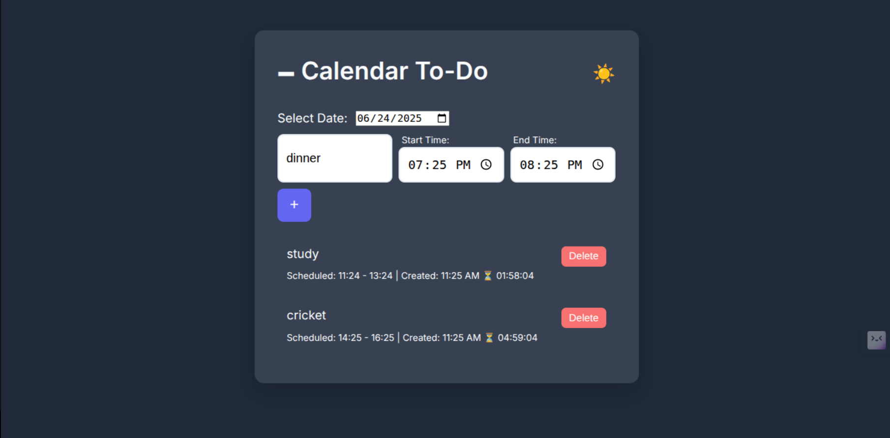
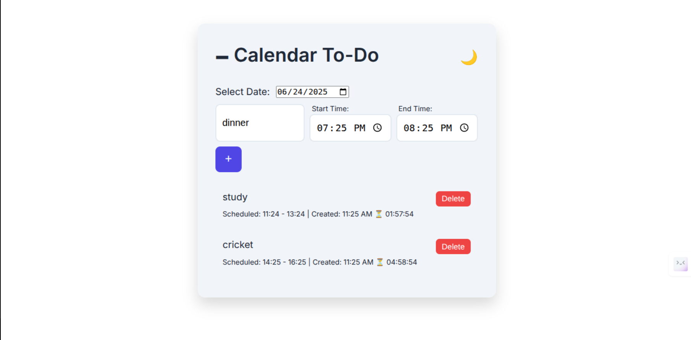

# To-Do List Web App

A responsive and animated to-do list app using **HTML**, **CSS**, and **Vanilla JavaScript**. Organize tasks by date with start and end times, live countdowns, and automatic overdue alerts — all in default dark mode.

---

## ✨ Features

* 📆 Organize tasks by calendar date
* 🕒 Add **Start Time** and **End Time**
* 📝 Shows **Created Time** automatically
* ⏳ **Live Countdown** to task end time
* ⚠️ Highlights **Overdue Tasks**
* ✅ Mark task as complete
* 🗑️ Delete task instantly
* 🌙 **Dark Mode Default** with toggle
* 💻 Fully responsive and smooth UI/UX

---

## 📂 Project Structure

```
todo-app/
├── index.html        # App layout
├── style.css         # Custom styles and themes
├── script.js         # Main functionality and logic
├── README.md         # Documentation
└── screenshots/      # Screenshots
    ├── dark.png
    └── light.png
```

---

## 📸 Screenshots

> 💡 Place screenshots inside the `screenshots/` folder:

### 🌙 Dark Mode



### ☀️ Light Mode



---

## ▶️ How to Run

1. **Clone the repository**

   ```bash
   git clone https://github.com/bhagwan388/todo-app.git
   cd todo-app
   ```

2. **Open `index.html`** in your browser
   Or launch using **Live Server** in VS Code.

3. **Start adding tasks** with date and time!

---

## 🙋 Author

**Bhagwan Arsewad**
🔗 [GitHub](https://github.com/bhagwan388)
🔗 [LinkedIn](https://www.linkedin.com/in/bhagwan-arsewad-0bb7b5279/)
🔗 [Instagram](https://www.instagram.com/bhagwan_arsewad/)

---

## 📄 License

This project is licensed under the MIT License — free to use, modify, and distribute.
